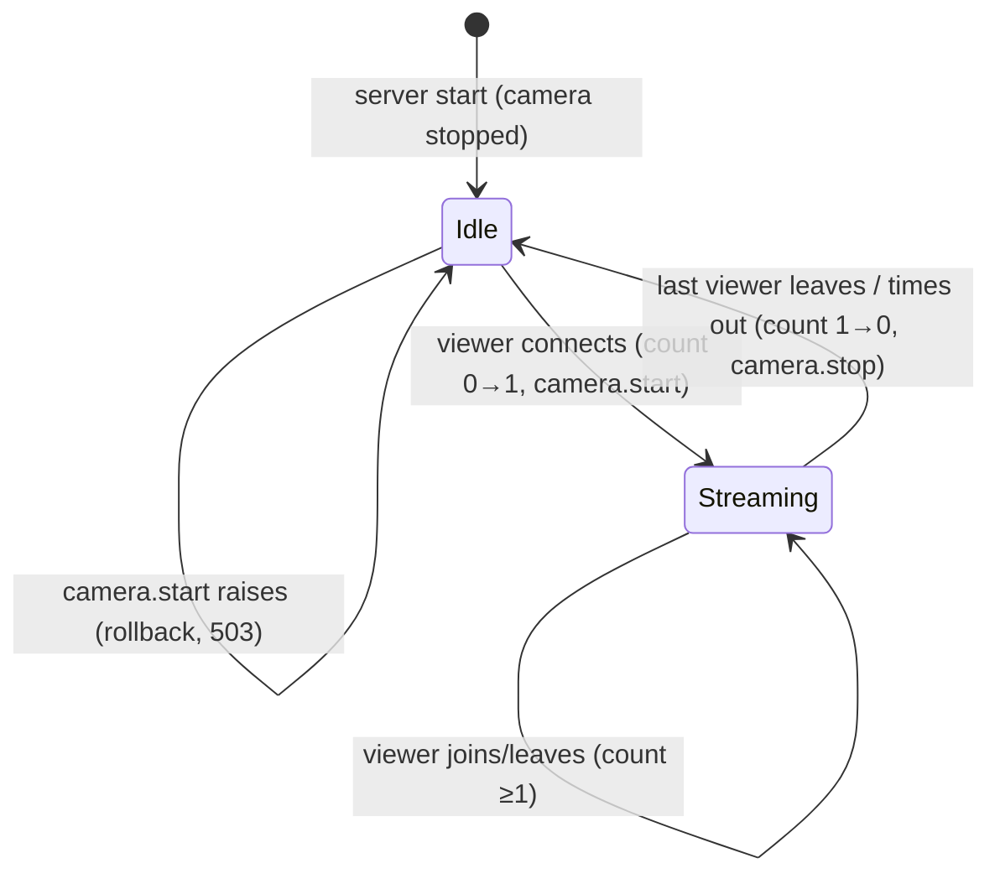
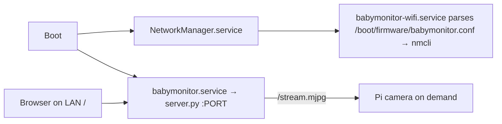

# feat: Raspberry Pi on-demand video monitor

## Goal Capsule

- **Objective:** A Raspberry Pi with a Pi camera boots, joins the Wi‑Fi named in a user-editable config file, and serves live video at `http://<pi-host>:<port>/`. The camera runs only while at least one viewer is connected.
- **Authority:** This plan > repo conventions (repo is empty; none yet) > implementer judgment.
- **Stop conditions:** Stop and surface if picamera2 cannot be used on the target OS, or if NetworkManager is not the network stack on the target image.
- **Tail ownership:** Caller (LFG) owns review, commit, and shipping.

---

## Product Contract

### Summary

Ship a small Python MJPEG streaming server, a Wi‑Fi bootstrap script driven by a config file, systemd units, and one install script that configures a fresh Raspberry Pi OS to run everything on boot.

### Problem Frame

The user has a Pi and a Pi camera and wants a baby-monitor-style live view in a browser. They want zero manual steps after install: power on → Wi‑Fi connects from their config file → stream is reachable at the Pi's address. The camera must stay idle (no capture, no encoding) when nobody is watching.

### Requirements

**Streaming**
- R1. Opening `http://<pi-host>:<port>/` in a browser shows live video from the Pi camera.
- R2. The camera starts capturing when the first viewer connects and stops within seconds of the last viewer disconnecting, including dead/stalled clients.
- R3. Multiple simultaneous viewers are supported, up to a configurable cap.
- R4. The server listens on all interfaces so the Pi's machine address (IP or `<hostname>.local`) works.

**Configuration & boot**
- R5. A single config file holds Wi‑Fi SSID, password, country, and stream settings (port, resolution).
- R6. On every boot, the Pi applies the Wi‑Fi settings from that config file and connects automatically.
- R7. An install script configures the Pi so the Wi‑Fi bootstrap and stream server start automatically on boot and restart on failure.

### Scope Boundaries

- Not included (user-confirmed): audio, authentication, internet/public exposure. The stream is served on the local network only.
- Not included: recording, motion detection, HTTPS/TLS.

### Deferred to Follow-Up Work

- wpa_supplicant support for pre-Bookworm images (Bullseye).
- H.264/WebRTC streaming for lower bandwidth.
- Scrubbing the Wi‑Fi PSK from the FAT boot partition after import (kept so the user can keep editing one file; physical SD access is already full compromise).
- Basic auth and remote access, if the monitor ever leaves the LAN.

---

## Planning Contract

### Key Technical Decisions

- KTD1. **MJPEG over HTTP with picamera2 `JpegEncoder`.** Browsers render `multipart/x-mixed-replace` natively in an `` tag — no JS player, no extra dependencies. picamera2 ships with Raspberry Pi OS (`python3-picamera2`). Chosen over HLS/WebRTC (latency or complexity).
- KTD2. **Stdlib `http.server.ThreadingHTTPServer`.** No pip dependencies; runs with system Python so picamera2 (apt-installed) is importable.
- KTD3. **Viewer ref-count drives the camera.** `StreamingOutput` keeps the viewer count under its own `threading.Lock`, separate from the frame `Condition`; 0→1 calls `camera.start()`, 1→0 calls `camera.stop()`, and start/stop never run while holding the frame Condition (picamera2 `stop_recording` joins encoder threads that call `write()`). If `start()` raises, the count rolls back. The camera is injected so tests use a fake; picamera2 is imported lazily.
- KTD4. **Config file on the boot partition (`/boot/firmware/babymonitor.conf`).** Editable from any computer by mounting the SD card. `KEY=value` lines parsed literally (never `source`d) by both bash and Python with identical rules: skip comments/blank lines, strip trailing `\r`, strip one pair of surrounding quotes, no expansion.
- KTD5. **NetworkManager via `nmcli` for Wi‑Fi.** Default on Raspberry Pi OS Bookworm. The bootstrap oneshot creates/updates a connection named `babymonitor-wifi` with `autoconnect yes`, idempotent across reboots.
- KTD6. **Two systemd units.** `babymonitor-wifi.service` (root oneshot; `Requires=`/`After=NetworkManager.service`, `Before=network-online.target`). `babymonitor.service` (`Restart=always`, no network ordering since it binds `0.0.0.0`; runs as system user `babymonitor` in group `video` with `NoNewPrivileges`, `ProtectSystem=strict`, `ProtectHome`).
- KTD7. **Dead-client detection by timeouts.** Stream socket gets a write timeout (~10s) and frame waits use a timeout (~5s); timeout or `OSError` ends the handler, whose `finally` removes the viewer.

### High-Level Technical Design





### Assumptions

- Target is Raspberry Pi OS Bookworm (NetworkManager, `/boot/firmware`, libcamera). Install exits with an error if `/boot/firmware` is absent.
- The URL is the Pi's local machine address (`http://<ip-or-hostname.local>:8000/`), confirmed by the user.
- Default port 8000, resolution 1280x720, max 5 viewers.
- First install needs network (apt, clone): user sets Wi‑Fi in Raspberry Pi Imager or uses Ethernet; `babymonitor.conf` governs Wi‑Fi from then on.

### Output Structure

```text
babymonitor/server.py
babymonitor/test_server.py
config/babymonitor.conf.example
scripts/install.sh
scripts/wifi-setup.sh
systemd/babymonitor.service
systemd/babymonitor-wifi.service
README.md
```

---

## Implementation Units

### U1. Streaming server with on-demand camera

**Goal:** HTTP server serving an index page and an MJPEG stream; camera runs only while viewers exist.
**Requirements:** R1, R2, R3, R4; KTD1, KTD2, KTD3, KTD7.
**Dependencies:** none.
**Files:** `babymonitor/server.py`, `babymonitor/test_server.py`
**Approach:** `StreamingOutput` (io.BufferedIOBase) holds latest frame + `Condition`, plus a separate viewer lock/count; clears the last frame on stop. `add_viewer()` enforces `MAX_VIEWERS` and rolls back on start failure. `PiCamera` wrapper lazily imports picamera2 and starts/stops a `JpegEncoder` recording into the output. Handler serves `/` (HTML with ``), `/stream.mjpg` (multipart loop; 503 on cap or start failure; timeouts per KTD7), 404 otherwise. Logs "camera started"/"camera stopped". Config path from `BABYMONITOR_CONFIG`.
**Test scenarios:**
- First viewer triggers exactly one `start`; frames written to output reach a client reading `/stream.mjpg`.
- Two viewers → one `start`; first leaves → no `stop`; second leaves → one `stop`.
- Client disconnect mid-stream decrements the count (camera stops).
- Camera producing no frames → handler exits within the wait timeout and camera stops.
- Fake camera `start` raises → 503, count back to 0, next viewer retries start.
- Fake camera whose `stop` calls `write()` from another thread and joins it → no deadlock.
- Viewer cap reached → 503.
- `/` returns 200 HTML with the stream ``; unknown path → 404.
- Config parser: comments, blank lines, CRLF, quoted values, `$`/backtick/`"` in values kept literally, missing keys → defaults.
**Verification:** Tests pass on a machine without picamera2 using a fake camera.

### U2. Config file and Wi‑Fi bootstrap

**Goal:** User edits one file; Pi connects to that Wi‑Fi on every boot.
**Requirements:** R5, R6; KTD4, KTD5, KTD6.
**Dependencies:** none.
**Files:** `config/babymonitor.conf.example`, `scripts/wifi-setup.sh`, `systemd/babymonitor-wifi.service`
**Approach:** Script parses the config literally (KTD4), exits cleanly if SSID empty, waits (bounded) for `nmcli general status`, sets WLAN country (`raspi-config nonint do_wifi_country` when available), unblocks rfkill, add-or-modify `babymonitor-wifi` (wpa-psk, autoconnect), then `nmcli --wait 15 con up … || true`.
**Test expectation:** none automated beyond `bash -n` — hardware/NM-dependent; smoke on device.
**Verification:** After editing config and rebooting, `nmcli con show --active` lists `babymonitor-wifi`.

### U3. Install script and server unit

**Goal:** One command configures a fresh Pi to run everything on boot.
**Requirements:** R7; KTD6.
**Dependencies:** U1, U2.
**Files:** `scripts/install.sh`, `systemd/babymonitor.service`
**Approach:** Requires root; errors if `/boot/firmware` absent. apt-installs `python3-picamera2 --no-install-recommends`; creates system user `babymonitor` (group `video`); copies code to `/opt/babymonitor`; copies example config to the boot partition only if none exists. Enables `babymonitor-wifi.service` without `--now` (avoid dropping the SSH session mid-install; applies next boot) and `enable --now` for `babymonitor.service`. Prints the URL. Idempotent on re-run.
**Test expectation:** none automated beyond `bash -n` — system install script; smoke on device.
**Verification:** After install + reboot, `systemctl is-active babymonitor` is active and the URL shows video.

### U4. README

**Goal:** End-to-end setup instructions.
**Requirements:** R1–R7.
**Dependencies:** U1–U3.
**Files:** `README.md`
**Approach:** Flash Bookworm with Imager (set initial Wi‑Fi + SSH), clone repo, run install, edit config, reboot, open URL. Troubleshooting (`rpicam-hello --list-cameras`, `journalctl -u babymonitor`). Note that the stream is unauthenticated and meant for the local network only.
**Test expectation:** none -- docs.

---

## Verification Contract

- `python3 -m unittest discover -s babymonitor -v` passes.
- `bash -n scripts/*.sh` passes.
- On-device smoke (manual, user): install, reboot, open URL, close tab, confirm "camera stopped" in `journalctl -u babymonitor` within ~10s.

## Definition of Done

- U1–U4 complete; unit tests and syntax checks pass locally.
- No pip dependencies; runs on system Python with apt `python3-picamera2`.
- User config is never overwritten by re-running install.
